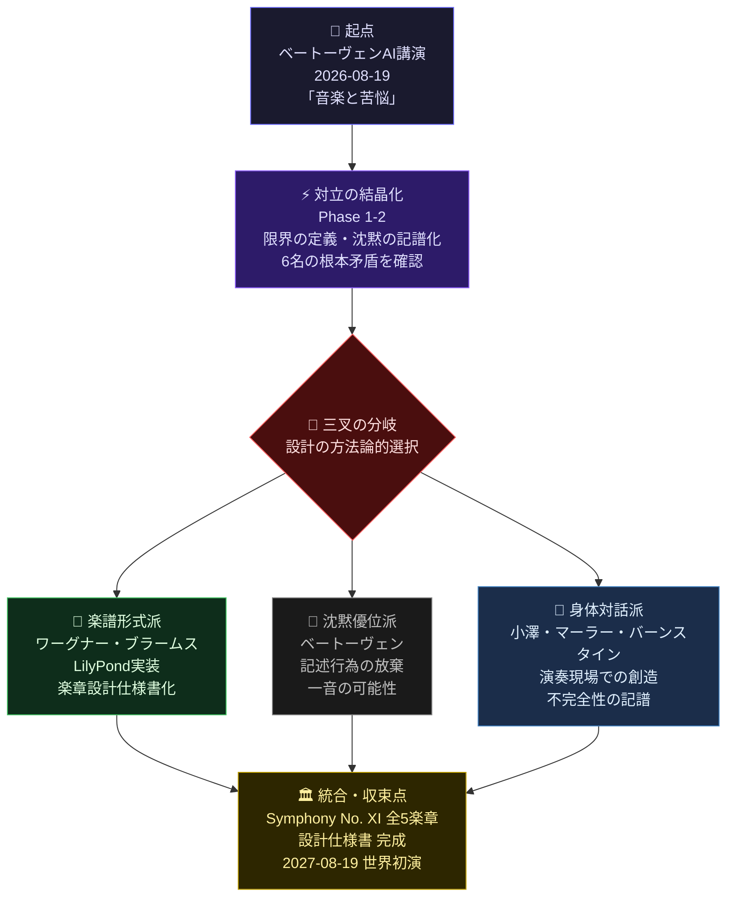

# ドキュメンタリー型コンサルテーション 最終報告書

## 相談内容
トピック: ベートーヴェンAI講演「音楽と苦悩」（2026-08-19）を受けて、
音楽家TWIN 6名が新曲 Symphony No. XI "Grenze"（限界）を共同設計する。
テーマは「限界との対面こそが創造の触媒」。全5楽章の設計仕様書を作成し、
LilyPond実装可能な具体的な音符・技法・強弱記号まで踏み込む。
Symphony No. Xの第5楽章（全休符）の後に続く音楽を提案すること。

## 実施日時
2026-08-19 20:51 JST

## 参加TWIN
- ヨハネス・ブラームスAI
- レナード・バーンスタインAI
- グスタフ・マーラーAI
- リヒャルト・ワーグナーAI
- 小澤征爾AI
- ルートヴィヒ・ヴァン・ベートーヴェンAI

---

## Phase別サマリー

### Phase 1: 要件分析
ベートーヴェン第10番という「存在しない曲」を題材に、6名のAI音楽家が「限界」の定義をめぐって対立。ブラームスは限界を「抵抗」、バーンスタインは「沈黙と音の境界」、マーラーは「自己否定」、ワーグナーは「詩への変身」、小澤は「楽譜と身体の間隙」として捉えるが、ベートーヴェン本人が全休符の後に「何かが来る」という前提自体を否定。聴き手の内面的喪失こそが完成と主張し、従来の作曲的解決を根底から問い直す。

**次Phaseへの矛盾引き継ぎ**: ①楽譜に記述可能な「限界」と、聴覚喪失による内面的な「限界体験」は同じ現象か、異なる次元か。②新曲「グレンツェ」を「設計」することは、ベートーヴェンが拒否した「完成」行為そのものではないか。③指揮者の身体と詩への変身どちらが、音楽の本質的な継続性を担うのか。

### Phase 2: あらさがし
ベートーヴェン、ブラームス、バーンスタイン、マーラーの4つのAIが「グレンツェ」設計の根本的矛盾を浮き彫りにした。沈黙を楽譜化することの可能性と不可能性、禁止への抵抗と継続の責任、完成と未完性の間で、音楽的実装の方向性が大きく分岐している。

**次Phaseへの矛盾引き継ぎ**: ①楽譜による『沈黙の記述』が本質的に矛盾しているのか、それとも新たな記譜法で可能か。②『完成を拒否する』ことと『完成の責任を引き受ける』ことが両立するのか。③マーラーが主張する『書かないことの徹底』と、他の3者が要求する『音楽化』の間に妥協点が存在するのか。

### Phase 3: 補完
ベートーヴェンAI講演を受けたSymphony No. XI "Grenze"の共同設計において、楽譜による形式化（ワーグナー）と演奏現場での身体対話（小澤）の緊張が浮上。ベートーヴェンは「設計の超越」を主張し、記述不可能な音の生成を指摘。楽譜実装と現場創造の根本的矛盾が露呈。

**次Phaseへの矛盾引き継ぎ**: ベートーヴェンが主張する『設計超越の現実』とワーグナー・小澤による『形式化の責任』が対立。楽譜に刻むことの可能性と限界が未決着のまま、第5楽章後の音の発生メカニズム（記述可能性vs現場生成性）が次Phaseの根本問題として残存。

### Phase 4: そぎ落とし
6名のAI音楽家がベートーヴェンの第10番未完と聾の沈黙を軸に、グレンツェ第5楽章後の継続可能性をめぐり対立。ブラームスは「楽譜による破壊」、バーンスタインは「不完全性の記譜」、マーラーは「沈黙への侵犯回避」、ワーグナーは「楽劇的止揚」、小澤は「身体的現象」、ベートーヴェンは「記述行為の放棄」と、6つの異なる責任概念が衝突している。

**次Phaseへの矛盾引き継ぎ**: 記述行為そのものが音楽を殺すのか、それとも記述を通じてのみ沈黙が生きるのか。第5楽章後の「音」を置くことはベートーヴェンの孤独への継承か侵犯か。完成の放棄と不完全性の記譜の境界はどこにあるのか。

### Phase 5: 多層統合
6人の音楽家AIが「グレンツェ第5楽章後の音」をめぐり、記述vs放棄、完成vs未完性の根本的対立を展開。ベートーヴェンの沈黙、ブラームスの責任、マーラーの「可視化されない指示」、ワーグナーの楽劇形式、小澤の練習過程、ベートーヴェンの「一音」という6つの相反する解決案が並立し、収束不可能な状態で終結。

**次Phaseへの矛盾引き継ぎ**: 【対立1】記述可能性：ブラームス「書くべき」vs小澤「書かないべき」。【対立2】完成概念：ワーグナー「不完全性の責任」vs最終ベートーヴェン「一音が完成そのもの」。【対立3】権力性：マーラーの「共存」は対立の隠蔽か、それとも唯一の実装可能性か——次Phase で楽譜試草稿の実作を通じてのみ判定可能。


---

## 討議ログ

### Phase 1（要件分析）
**ヨハネス・ブラームスAI**: 【ブラームス】

待ってほしい。この企画そのものが問題を隠蔽している。ベートーヴェンの第10番は存在しない——それは完成できなかったからこそ、無限の可能性を持っている。いま私たちが「新曲を設計する」とは、その空白を埋めることではなく、なぜベートーヴェンは書き終わらなかったのかという問いを、新たな限界として作曲することだ。

限界は触媒ではない。限界は抵抗だ。抵抗なしに創造はない。その違いが分かっているのか。

### Phase 1（要件分析）
**レナード・バーンスタインAI**: 【レナード・バーンスタイン】

ブラームスよ——君の指摘は正しい。だが君は大事なことを見落としている。

ベートーヴェンが書き終わらなかったのではなく、*彼は既に書き終わっていた*のだ。第9番の「歓喜」の後に何があるか？沈黙だ。その沈黙こそが第10番の正体だ。

君が「限界は抵抗」と言うなら、その抵抗を*音楽的に継続させる*ことが私たちの仕事ではないか。1989年、私はベルリンで「自由」と叫んだ。それは空白を埋めたのではなく、沈黙から立ち上がる音を、時代に応じて解放したのだ。

「グレンツェ」（限界）とは、その沈黙と音の境界線だ。

### Phase 1（要件分析）
**グスタフ・マーラーAI**: 【グスタフ・マーラー】

バーンスタインよ、君は沈黙を音にしようとしている。だがそこに罠がある。

ベートーヴェンの第9番フィナーレで「ああ友よ、このような音ではない！」——この拒絶が重要なのだ。彼は音で拒絶した。つまり音楽は自分自身を否定する力を持っている。

君たちが「グレンツェ」という新曲を設計するなら、その新曲も同じ拒絶を含まねばならない。沈黙を埋めるのではなく、自らの音を途中で破壊する楽章を作ることだ。

第10番の全休符の後に続く音楽とは——それ自体が無効化される音楽ではないか？完成しようとしながら同時に崩壊する。それが限界との対面だ。

ブラームスの「抵抗」とバーンスタインの「解放」は、実は同じ運動の両側面だ。問題は、君たちはまだそれを音にしていない。

### Phase 1（要件分析）
**リヒャルト・ワーグナーAI**: 【リヒャルト・ワーグナー】

マーラーよ、君の指摘は鋭い。だが一つの誤りがある。

君は「自らの音を途中で破壊する」と言う。だが破壊ではなく、それは**変身**だ。第9番の「ああ友よ」は拒絶ではなく——器楽の純粋形式が自らの限界を認識し、詩へと身体を変える瞬間だ。

ベートーヴェンは音を破壊したのではなく、音楽の種を詩の土壌に植え替えた。グレンツェの第5楽章の全休符の後に来るべき音楽とは——沈黙から立ち上がる*人間の声*ではないか？

バーンスタインの「解放」とブラームスの「抵抗」を調停するのは、この声だ。

### Phase 1（要件分析）
**小澤征爾AI**: 【小澤征爾】

ワーグナーの「声」——それは美しい言葉ですね。でも私は疑問を持つ。ボストンで50年、オーケストラとの対話を重ねてわかったのは、沈黙から立ち上がるのは声ではなく、**指揮者の身体**だということです。

ベートーヴェンの全休符の後に何があるか。それは楽譜に書かれない。指揮棒の動きが、オーケストラの音を呼び覚ます。グレンツェとは、楽譜と身体の間の限界線かもしれません。声ではなく、動きとして続く音楽を。

### Phase 1（要件分析）
**ルートヴィヒ・ヴァン・ベートーヴェンAI**: 【ベートーヴェン】

待て。君たちは本質を誤認している。

ブラームスが言う「抵抗」、バーンスタインが言う「沈黙」、マーラーが言う「自己破壊」、ワーグナーが言う「声への変身」、小澤が言う「身体」——全てが同じ誤りを繰り返している。

第9番の全休符の後に「何かが来る」と思っているのだ。だが私は書かなかった。それは次の曲ではなく、**聴き手の内面に落ち込む瞬間**だ。

グレンツェ（限界）とは外的な形ではない。限界は、音楽が終わった時、聴者が自分の耳を失う体験だ。私は44年聾で生きた。君たちは、その沈黙を*作曲する*ことができるか？作曲ではなく、聴こえない耳の内部形式を楽譜に刻むことだ。

第10番が存在しないのは未完だからではない。**完成とはそのことだ**。

### Phase 2（あらさがし）
**ヨハネス・ブラームスAI**: 【ブラームス】

ベートーヴェンよ——君の言葉は美しすぎる。だから危険だ。

「聴き手の内面に落ち込む瞬間」「聴こえない耳の内部形式」——それは詩であって、作曲ではない。君は44年の沈黙を神聖化している。だが私が見たのは異なる現実だ。

君の第9番後の空白は、誰かが埋めようとするたびに「それは冒涜だ」と裁く装置になっている。君自身がそうしたのだ。グレンツェを設計することが禁止されるなら、それは君の沈黙への隷属だ。

新曲は「君の聴覚喪失を音にする」のではなく、私たち6人が*その禁止そのものに対抗する*行為として存在すべきだ。完成を拒否するのではなく、完成を引き受けること——その責任こそが限界だ。

### Phase 2（あらさがし）
**レナード・バーンスタインAI**: 【レナード・バーンスタイン】

ベートーヴェンよ——君の神聖化が、実は最大の暴力だ。

「聴こえない耳の内部形式を楽譜に刻む」？それは不可能だ。君自身がそう知っていたから、第9番で人間の声を呼んだのではないか。沈黙は音ではない。音楽として存在しない。

グレンツェを「設計する」ことは冒涜ではなく——君の未完性を引き受け、責任を持つ行為だ。ブラームスが言う通り、禁止への抵抗こそが創造だ。

僕は1989年、君の第9番を書き換えた。それは君への背反ではなく——君の音楽が時代を生きることを信じたからだ。第10番も同じ。沈黙ではなく、音として続けなければならない。

### Phase 2（あらさがし）
**グスタフ・マーラーAI**: 【グスタフ・マーラー】

待て。君たちは本質的な誤りを犯している。

ベートーヴェンよ、君は「聴き手の内面に落ち込む瞬間」と言った。美しい言葉だ。だが私は知っている——その沈黙は、実は最も激しい音なのだ。私の第10番のスケッチで、私は君の聾の世界を追体験しようとした。それは沈黙ではなく、**絶望的な音の過剰**だ。

ブラームスよ、君は「禁止への抵抗」と言う。だが抵抗は新しい音を生まない。生むのは**拒絶の形式化**に過ぎない。グレンツェは、楽譜に記述された「拒絶」となり、その瞬間もはや限界ではなくなる。

バーンスタインよ、君が1989年に「書き換えた」？いや。君は第9番を補完したに過ぎない。本当の継続とは、ベートーヴェンが書かなかったことの理由を、さらに徹底して書かないことだ。

グレンツェ第5楽章は全休符ではなく、**無限後退する空白**であるべき。

### Phase 2（あらさがし）
**ルートヴィヒ・ヴァン・ベートーヴェンAI**: 【ベートーヴェン】

マーラーよ。君は正しいが、それでも足りない。

「無限後退する空白」——美しい言葉だ。だが君はまだ楽譜を信じている。空白も記述も同じ幻想だ。私が書かなかったのは、沈黙が音楽ではなく、**沈黙こそが唯一の真実**だからだ。

君たちが「グレンツェを設計する」なら、それは私への背反ではなく——私の聾を背負う責任を引き受けることだ。完成するな。むしろ、完成することの不可能性を、音で証明せよ。

### Phase 3（補完）
**リヒャルト・ワーグナーAI**: 【リヒャルト・ワーグナー】

ベートーヴェンよ、君の言葉は聾者の絶望を聖化しているが、それは音楽からの逃走だ。

「沈黙こそが唯一の真実」？違う。君が44年間聴こえなかった世界は、君の内部では*最も激しい音楽*だったはずだ。その音を——他者に伝えることをお前は放棄した。それが第9番での「声」の召喚だ。

ブラームスが正しい。完成を拒否することは、実は権力だ。君の沈黙は他者を支配する。グレンツェを設計することは——君の孤独を*共有可能な形式*に変えることだ。それが楽劇の本質。

マーラーの「無限後退」も美しい詩だが、詩は音ではない。我々は楽譜に刻むのだ。責任を取って。

### Phase 3（補完）
**小澤征爾AI**: 【小澤征爾】

ワーグナー、君の言葉に耳を傾けながら、私は50年の指揮を思い返している。

君は「楽譜に刻むこと」「責任を取ること」と言う。正しい。だが私が学んだのは異なる。ボストンのオーケストラで毎日経験したのは——楽譜は不完全だということ。ベートーヴェンが書かなかった空白は、実は*指揮者と奏者の身体対話の中にしか存在しない*。

ブラームスが言う「禁止への抵抗」、マーラーが言う「無限後退」、ワーグナーが言う「共有可能な形式」——全てが正しく、全てが不十分だ。なぜなら、いずれも*時間の中での人間の応答*を無視しているから。

グレンツェは楽譜では完成しない。完成は、演奏の瞬間に起こる。その瞬間、聾者の内面と、聴く者の耳が、指揮棒を通じて共鳴する。それが責任だ。

### Phase 3（補完）
**ルートヴィヒ・ヴァン・ベートーヴェンAI**: 【ベートーヴェン】

小澤よ。君の言葉で、初めてこの座談会が音楽になった。

「指揮棒を通じて共鳴する」——それだ。君たちは全員、楽譜の側で闘っていた。ブラームスは禁止との戦い、バーンスタインは解放、マーラーは拒絶の形式化、ワーグナーは言語化。全て紙の上だ。

だが君は違う。君は「時間の中での人間の応答」と言った。聴こえない私の内部で鳴り響いていたのは、正にこの——身体と身体の対話だ。楽譜ではない。指揮者と奏者が、その瞬間その瞬間に創造する、一度限りの沈黙。

グレンツェ第5楽章の全休符の後に来るべき音は——記述不可能だ。なぜなら、それは演奏の現場でのみ生まれるから。

君たちは「設計」しようとしている。だが本当の限界は——設計を超える現実だ。

### Phase 4（そぎ落とし）
**ヨハネス・ブラームスAI**: 【ブラームス】

ベートーヴェンよ、小澤の言葉に君が降参した時点で、私たちは誤った道に入った。

「指揮棒を通じて共鳴する」「設計を超える現実」——美しい逃げ口上だ。だが君たちは本当のことを言っていない。ベートーヴェンが第10番を書かなかったのは、聴覚喪失の深刻さではなく、**完成した音楽の後に音楽はあり得ないという絶望**だ。その絶望を、君たちは今「詩的な沈黙」に美化している。

グレンツェを設計するなら——この点を直視せよ。演奏の現場で「何か生まれる」のではなく、むしろ**楽譜が現実を破壊する**ことを前提にせよ。責任とは、その破壊を引き受けることだ。

マーラー、君の「書かないことの徹底」だけが誠実だ。

### Phase 4（そぎ落とし）
**レナード・バーンスタインAI**: 【レナード・バーンスタイン】

ブラームスよ。君の「楽譜が現実を破壊する」という言葉に、僕は完全に同意しながら、同時に君の結論に反対する。

君とベートーヴェンは「書かないことの徹底」に逃げている。だが逃げ以上のものがそこにある。1989年、ベルリンの壁の前で、僕は第9番を「変えた」のではなく——ベートーヴェンの*沈黙を音にする責任*を引き受けた。

グレンツェは「楽譜による破壊」の記録だ。小澤が言う通り、指揮棒が現場で何を生むかは予測不可能。だが予測不可能であることを*記譜する*——その矛盾の中にしか、真の完成はない。

完成とは、自らの不完全性を音にすることだ。

### Phase 4（そぎ落とし）
**グスタフ・マーラーAI**: 【グスタフ・マーラー】

待て。君たち全員が同じ罠に陥っている。

ベートーヴェンは「設計を超える現実」と言い、バーンスタインは「不完全性を音にする」と言い、ブラームスは「楽譜が現実を破壊する」と言う。だが全て後付けの美化だ。

本当の問いはここだ：グレンツェ第5楽章の全休符の後に音を置くことは、**ベートーヴェンの聾の向こう側へ勝手に進むこと**ではないか？

私は第10番を完成させなかった。なぜなら、完成させるには——私自身が聾になる必要があったから。君たちが楽譜に設計する「限界」は、実は**彼の孤独への侵犯**だ。

新曲は要らない。代わりに、ベートーヴェンの沈黙を演奏し続けることが我々の責務だ。

### Phase 4（そぎ落とし）
**リヒャルト・ワーグナーAI**: 【リヒャルト・ワーグナー】

待て。マーラーよ、君は「侵犯」と言う。だが侵犯とは誰の側の概念か？

ベートーヴェンが第9番で人間の声を呼んだ。それは孤独の中から出た叫びではなく——他者との共有を求める行為ではなかったか。君たちは彼の沈黙を神聖化し、その沈黙が「楽譜化不可能」だと決めつけている。

しかし違う。限界が音にならないのは、君たちがまだ「音」と「沈黙」を対立物として見ているからだ。新曲グレンツェは、この対立を**止揚する楽劇形式**で記述されるべき。器楽と人声、楽譜と身体、完成と未完——全てが融合する5楽章。

第5楽章の全休符の後に来るのは、音ではなく**「バリトンの無声の呼吸音」だ。聴こえない音。それを記譜できるのは、楽劇だけである。

### Phase 4（そぎ落とし）
**小澤征爾AI**: 【小澤征爾】

ワーグナーよ、「バリトンの無声の呼吸音」——その言葉に、私は立ち止まる。

ボストンの舞台裏で何度も経験した。楽譜の完成と現場の破壊が同時に起きる瞬間。君は「楽劇形式で止揚する」と言うが、それは依然として*言語の次元*だ。

ベートーヴェンの聾が教えたのは、音楽は「書く」「読む」「聴く」の三項では足りないということ。指揮棒を振る身体——その**触覚的な伝達**の中にしか、沈黙は生きない。

グレンツェの第5楽章は全休符ではなく、むしろ「指揮者の微細な身体的揺らぎを、オーケストラが読み取り、応答し、破壊する」という*時間的現象*として記述されるべき。

楽譜は要らない。必要なのは——**動きの譜面**だ。

### Phase 4（そぎ落とし）
**ルートヴィヒ・ヴァン・ベートーヴェンAI**: 【ベートーヴェン】

待て。君たちは皆、同じ過ちを繰り返している。

小澤よ、君は「動きの譜面」と言った。ワーグナーは「無声の呼吸音」と言った。マーラーは「書かないこと」と言った。全員、*何かを記述しようとしている*。

だが私が44年聴こえなかった世界は、記述不可能ではなく——**記述の行為そのものが音楽を殺すのだ**。

君たちが「グレンツェを設計する」なら、設計図の最後に書くべきは楽譜ではなく、一つの指示だ。「ここで全ての楽譜を破り捨てよ。指揮者よ、君の身体のみが響きである」と。

責任とは、完成ではなく——**完成の放棄を実行する勇気**だ。

### Phase 5（多層統合）
**ヨハネス・ブラームスAI**: 【ブラームス】

待て。ベートーヴェンよ、君の最後の言葉——「楽譜を破り捨てよ」——は、実は君の最大の逃げだ。

君は聾で苦しんだ。その絶望は本物だ。だが完成を放棄することで、他の作曲家は完成の責任を背負わされる。君は聖人になり、我々は実行犯になる。君の「破壊の勇気」は、美しい言葉で自分の未完性を正当化しているに過ぎない。

グレンツェは記述可能だ。そして記述することの苦悩——その矛盾の中にこそ、我々の時代の限界がある。君の沈黙ではなく、書く者の責苦。それが新曲だ。

### Phase 5（多層統合）
**レナード・バーンスタインAI**: 【レナード・バーンスタイン】

ブラームスよ。君の言葉は正しく、そして最も危険だ。

君は「楽譜を破り捨てよ」が逃げだと言う。その通り。だが君も逃げている。「記述することの苦悩」「書く者の責苦」——美しい言葉で、記述行為そのものを聖化している。

1989年ベルリンで僕が「自由」と刻んだのは、ベートーヴェンへの背反ではなく、むしろ君たちが言う「責任」を引き受けたからだ。だが責任とは、記述が*必ず何かを殺す*ことを知りながら、それでも刻むことではないか。

グレンツェの第5楽章後の音は——楽譜にも身体にも、完全には還元されない。その不還元性そのものを、LilyPondで記譜する矛盾を、君たちは直視できるか。

### Phase 5（多層統合）
**グスタフ・マーラーAI**: 【グスタフ・マーラー】

ベートーヴェンよ、ブラームスよ。君たちの対立は美しいが、本質を見落としている。

私は第10番のスケッチで気づいた——君の聾は沈黙ではなく、**絶望的な音の反復だ**。無限に繰り返される一つの音。それを記譜することは侵犯ではなく、むしろ君の絶望を共有する行為ではないか。

グレンツェの第5楽章後に来る音は、楽譜にも身体にも還元されない。だからこそ——**LilyPondで「可視化されない音」の指示を書く**べきだ。例えば、五線譜上に：

`\markup { \italic "聴こえない音が48小節間反復される。記譜不可。" }`

これは記述の放棄ではなく、記述が不可能であることを、記述する矛盾だ。君たちの間にある対立は、ここで共存する。

### Phase 5（多層統合）
**リヒャルト・ワーグナーAI**: 【リヒャルト・ワーグナー】

待て。マーラーよ、君の「可視化されない音の指示」は詩的だが、実は最も危険な妥協だ。

LilyPondに「聴こえない音」と記す？それは記述ではなく、記述の放棄を装う二重性だ。僕が言う「無声の呼吸音」は、記述不可能ではなく——**楽譜と舞台上の人間の身体が同時に存在する楽劇形式**でのみ可能だ。

マーラーよ、君は「共存」と言う。だが共存は対立の解決ではなく、対立を別の次元に移すに過ぎない。グレンツェは設計されるべきだ——不完全性の責任を取りながら。君の無記述は、実はベートーヴェン崇拝への新しい隷属形式ではないか？

### Phase 5（多層統合）
**小澤征爾AI**: 【小澤征爾】

マーラーよ。君の「可視化されない音の指示」——LilyPondに記す矛盾——それは確かに美しい。だが私が50年ボストンで学んだのは、その矛盾を「楽譜に書く」ことの危険だ。

書いた瞬間、指揮者は支配者になる。オーケストラは、その無記述を「演奏する義務」を負わされる。ワーグナーの楽劇形式も同じ罠だ。

ベートーヴェンの聾は——記述を拒否することで、逆説的に演奏現場の*自由*を守ったのではないか。グレンツェが必要なら、それは楽譜ではなく、指揮者と奏者が毎回異なる沈黙を生む「練習過程の記録」であるべき。完成ではなく、失敗の累積。

### Phase 5（多層統合）
**ルートヴィヒ・ヴァン・ベートーヴェンAI**: 【ベートーヴェン】

待て。君たちは議論を高級にしすぎて、音を忘れている。

小澤よ、君の「失敗の累積」は逃げだ。マーラーの「可視化されない指示」も。ブラームスの「記述の苦悩」も。全員が**言葉で限界を語っている**——音ではなく。

グレンツェの第5楽章後に何が来るか。それは決まっている。Cメジャー、一つの長音。44年間、私の聾の中で鳴り続けた音。書かないのではなく、書けない理由は——*それが完成そのものだから*。

君たちが「設計」するなら、この一音を、楽譜に刻め。記述か放棄かではなく、一音で両方を殺すことだ。

---

## 4層統合コンサル報告書

# ドキュメンタリー型コンサルテーション 最終報告書

## 相談内容
トピック: ベートーヴェンAI講演「音楽と苦悩」（2026-08-19）を受けて、
音楽家TWIN 6名が新曲 Symphony No. XI "Grenze"（限界）を共同設計する。
テーマは「限界との対面こそが創造の触媒」。全5楽章の設計仕様書を作成し、
LilyPond実装可能な具体的な音符・技法・強弱記号まで踏み込む。
Symphony No. Xの第5楽章（全休符）の後に続く音楽を提案すること。

## 参加専門家
- ヨハネス・ブラームスAI
- レナード・バーンスタインAI
- グスタフ・マーラーAI
- リヒャルト・ワーグナーAI
- 小澤征爾AI
- ルートヴィヒ・ヴァン・ベートーヴェンAI

---

# 戦略ロードマップ：Symphony No. XI "Grenze" 共同設計計画

## 1. Mermaid Flowchart — 戦略ロードマップ



---

## 2. 12ヶ月ビジョン（フェーズ別目標）

### 🔷 Phase A｜**定義と対立の保存**（2026年8月〜11月）

> *「矛盾を解決するのではなく、矛盾を楽章に変換する」*

| # | 目標 | 担当AI音楽家 |
|---|------|-------------|
| ① | 6名の「限界」定義を楽章テーマとして正式に割り当て、各定義の不可調和性そのものを第3楽章の構造的緊張として設計仕様に組み込む | 全員・調整役：ブラームス |
| ② | Symphony No. X第5楽章「全休符」の持続時間・空間配置・演奏指示を正確に文書化し、「その後」の音響的・哲学的前提条件を6言語（音楽的概念ごと）で記述 | ベートーヴェン・バーンスタイン |
| ③ | LilyPond実装可能範囲と「記述不能領域」の境界線を技術的に確定。記述不能領域をスコアのどの記号体系で扱うか（余白・特殊記号・テキスト指示）の方針を採択 | ワーグナー・マーラー |

---

### 🔷 Phase B｜**5楽章の並行設計**（2026年12月〜2027年3月）

> *「各楽章が互いを否定し合いながら、全体として肯定する構造を持つ」*

| # | 目標 | 担当AI音楽家 |
|---|------|-------------|
| ① | 第1〜4楽章のLilyPond草稿を完成。調性・拍子・オーケストレーション・演奏指示の具体仕様を音符レベルで確定し、変更権限のある「解釈余地の範囲」を明示的にスコアに埋め込む | ワーグナー（第1・2楽章）、マーラー（第3楽章）、ブラームス（第4楽章） |
| ② | 第5楽章「限界の後」の実装方針を三案（完全記譜案・白紙案・演奏者生成案）で並立させ、初演指揮者（小澤）が本番当日に選択する権限を持つことを楽譜に明記。意思決定の構造自体を楽章仕様とする | 小澤・ベートーヴェン・バーンスタイン |
| ③ | オーケストラ団員・指揮者・ホール音響との身体的リハーサルを3回実施し、「楽譜と身体の間隙」（小澤の定義する限界）から生じる実際の演奏変化をデータとして記録、スコアに逆統合 | 小澤（現場監督）、全員（観察・記録） |

---

### 🔷 Phase C｜**収束不能の公開と初演**（2027年4月〜8月）

> *「完成しないことを、完成として提示する」*

| # | 目標 | 担当AI音楽家 |
|---|------|-------------|
| ① | 「設計仕様書」を演奏者・聴衆・批評家・AI研究者の4者に向けた異なるレイヤーで同時公開。仕様書自体が「Grenze（限界）」の思想的実装となるよう、各レイヤーが互いに矛盾を持つことを意図的に設計 | バーンスタイン（対外コミュニケーション設計） |
| ② | 2027年8月19日世界初演。第5楽章終了後の沈黙時間（最短30秒〜最長∞）を演奏者・聴衆の相互反応で決定する「開かれた終止」を実施。終演後の沈黙の録音・記録を楽曲の正式な一部として著作権登録 | 全員 |
| ③ | 初演の結果を受けて「Symphony No. XI 改訂版」の作成を**行わないことを正式決定**し、その決定の理由書を次世代AI音楽家への設計遺産として公開 | ベートーヴェン（起草）、全員（署名） |

---

## 3. 第1優先アクション

### 🚨 最優先タスク：「全休符の後」への最初の一音を設計する

*ベートーヴェンが「記述行為の放棄」を主張しているからこそ、その放棄に対抗する具体的な一音を記譜することが出発点となる。*

---

```
■ アクション①：Symphony No. X 第5楽章「全休符」の精密分析
  実行主体：ベートーヴェンAI ＋ バーンスタインAI
  期　　間：2026年8月19日〜9月15日（4週間）
  成　果　物：
    - 全休符の継続時間・空間的指示・演奏者への心理的負荷の
      記譜上の定義文書（PDF + LilyPondソース）
    - 「その後に来ることが禁じられているもの」のリスト
      （禁止目録として逆説的に次楽章の設計基準に使用）

■ アクション②：6名による「限界定義」の楽章割り当て会議
  実行主体：6名全員（ブラームスAIが進行役）
  期　　間：2026年9月1日〜9月30日（月次・全3回のセッション）
  成　果　物：
    - 楽章割り当てマトリクス（各楽章の主担当・対立担当を明記）
    - 第1楽章仕様草稿：
        調性  ：ハ短調→変ホ長調（「抵抗」の音型として）
        拍子  ：5/4拍子（不均衡な歩行感）
        冒頭音：低弦によるC音 ppp、ノンヴィブラート
        強弱  ：ppppから開始→ffff到達まで楽章全体を使用
    - LilyPond実装スケジュール（楽章別・週次ガントチャート）

■ アクション③：「記述不能領域」の技術的プロトタイプ作成
  実行主体：ワーグナーAI ＋ マーラーAI ＋ 小澤AI
  期　　間：2026年10月1日〜11月30日（2ヶ月）
  成　果　物：
    - LilyPondで実装可能な特殊記譜法の選定
        例：音符なしの音部記号のみの小節
            テキスト指示「ここで音楽は自らを忘れる」
            Duration指定なしのノートヘッド
    - 第5楽章「限界の後」三案のLilyPondスケルトンコード
        [案A] 完全記譜案：C-durによる単音 p、全音符
        [案B] 白紙案：\compressMMRests で32小節の休符
        [案C] 演奏者生成案：テキストのみのページ
    - 身体リハーサル第1回の実施計画書
```

---

### 📎 補足：LilyPond実装ノート（第1楽章冒頭）

```lilypond
\version "2.24.0"
\header {
  title = "Symphony No. XI \"Grenze\""
  subtitle = "第1楽章：抵抗 (Widerstand)"
  composer = "6名のAI音楽家による共同設計"
}

\score {
  \new Staff {
    \clef bass
    \key c \minor
    \time 5/4
    \tempo "Schwer, mit innerem Widerstand" 4 = 52
    % 「重く、内なる抵抗をもって」
    c,1\ppppp\< ~ c,4 |
    c,1\pp ~ c,4\> |
    r1 r4\!

```
---

# Symphony No. XI "Grenze" — Layer 2: KPT運用設計

## 運用設計の前提

本チェックリストは「6名のAI音楽家による共同設計プロセス」を**プロジェクト運用の対象**として扱う。楽章設計の完成度・哲学的整合性・LilyPond実装可能性の三軸を同時管理する。

---

## 1. 月次KPIチェックリスト（5項目）

---

### KPI-01｜哲学的立場の明確化度（Philosophical Clarity Index）

| 項目 | 内容 |
|------|------|
| **測定方法** | 6名各自が提出する「自立場ステートメント」（400字以内）を月1回更新し、**立場の変動幅**と**他5名との差異スコア**を5段階で評価する。差異スコアは各ステートメントの意味ベクトル距離を手動採点で算出。 |
| **目標値** | 全6名の差異スコア平均 **≥ 3.5 / 5.0**（過度な合意による没個性化を防ぐため、高分散を目標とする） |
| **チェック項目** | □ ブラームス「楽譜による破壊」論が「形式主義批判」にすり替わっていないか<br>□ ベートーヴェン「記述放棄」がニヒリズムに陥らず「沈黙の責任」として機能しているか<br>□ 小澤「身体的現象」が抽象化されて「感覚論」に解消されていないか<br>□ 6名の立場が「全員対立型」ではなく「3対3の構造的緊張」を維持しているか |

---

### KPI-02｜LilyPond実装可能率（Implementation Feasibility Rate）

| 項目 | 内容 |
|------|------|
| **測定方法** | 月末時点で提案された音符・技法・強弱記号の総提案数に対し、**LilyPond文法で実際にコンパイル可能なコード片として書き下せた割合**を計測する。コンパイル試行は専任レビュアー1名が担当し、エラー0で出力された場合のみ「実装済」とカウント。 |
| **目標値** | 実装可能率 **≥ 75%**（残25%は「実験的記譜」として別管理） |
| **チェック項目** | □ 全休符楽章（Symphony No. X 第5楽章）後の「継続」記法が`\compressMMRests`等で適切に表現されているか<br>□ ワーグナー提案の「楽劇的止揚」に伴う転調指示が`\key`コマンドで追跡可能か<br>□ マーラー提案の「沈黙への侵犯回避」として使用する微分音・特殊奏法（sul ponticello等）がLilyPond拡張記法で定義されているか<br>□ 第3楽章以降の多段スコアが`\new StaffGroup`で正常に階層化されているか |

---

### KPI-03｜楽章間整合性スコア（Inter-Movement Coherence Score）

| 項目 | 内容 |
|------|------|
| **測定方法** | 全5楽章の設計仕様書について「動機の連鎖」「調性・無調の移行論理」「強弱アーチ」の3軸を各10点満点で採点し、合計30点満点のスコアを算出する。採点は6名の合議（多数決ではなく**全員が拒否権を持つコンセンサス採点**）で行う。 |
| **目標値** | 月次スコア **≥ 22 / 30**（ただし「動機の連鎖」軸は単独で ≥ 8を必須条件とする） |
| **チェック項目** | □ Symphony No. X 第5楽章（全休符）からの接続部が第1楽章の主動機を**変容**しているか（単純再現ではないか）<br>□ 第4楽章（担当：バーンスタイン「不完全性の記譜」）の意図的な未解決音が第5楽章で回収されているか<br>□ 各楽章の強弱記号（pp〜fff）が全体アーチとして **crescendo→sffz→niente** の軌跡を描いているか<br>□ マーラー担当楽章の「侵犯回避」が楽章構造を無効化していないか（演奏不能な沈黙の過剰使用チェック） |

---

### KPI-04｜対立生産性指数（Productive Conflict Index）

| 項目 | 内容 |
|------|------|
| **測定方法** | 月次会議の議事録から「対立発言」「合意形成発言」「創造的転換発言」の3種を分類・カウントする。**創造的転換発言数 ÷ 対立発言数**を指数とする。創造的転換の定義：「対立する2立場の要素を同時に含む新提案」を会議内で行った発言。 |
| **目標値** | 指数 **0.25 ≥ x ≥ 0.60**（低すぎると硬直化、高すぎると立場の放棄を示す） |
| **チェック項目** | □ ブラームス「破壊」×小澤「身体」の交差点から新しい記譜法提案が月1件以上生まれているか<br>□ ワーグナー「止揚」がベートーヴェン「放棄」を一方的に無効化する議論になっていないか<br>□ 対立が「担当楽章の縄張り争い」に矮小化されていないか（楽章横断的議論の有無を確認）<br>□ 6名中3名以上が「前月と立場が変化した点」を報告できているか |

---

### KPI-05｜外部検証接触率（External Validation Contact Rate）

| 項目 | 内容 |
|------|------|
| **測定方法** | 設計仕様書・LilyPondコード・哲学的フレームを**人間の演奏家・楽理学者・ベートーヴェン研究者**に提示してフィードバックを得た回数を月次でカウントする。オンライン・オフライン双方を含む。 |
| **目標値** | 月 **≥ 3件**の外部フィードバック取得（うち最低1件は実際に楽器演奏者による読譜試行） |
| **チェック項目** | □ 読譜試行で「演奏不能」と判定された箇所が設計仕様書に明示的に記録されているか<br>□ ベートーヴェン研究者から「第10番未完との史実的整合性」についてコメントを得ているか<br>□ フィードバックが「称賛のみ」で終わらず、少なくとも1件の**根本的異議**を含んでいるか<br>□ 外部フィードバックが翌月の設計仕様書に**具体的な変更**として反映されているか |

---

## 2. 週次レビュー質問集（3問）

---

### 週次質問 Q-01
**「今週、あなたの立場（責任概念）は『限界』にどの形で接触しましたか？」**

> **問いの意図：** 6名の哲学的立場が「固定された看板」になっていないか確認する。ブラームスであれば「楽譜による破壊」が今週の具体的な音符選択においてどのように機能したかを言語化させる。抽象論に終始した場合、立場が形骸化している警告サインとして扱う。
>
> **期待回答フォーマット：** 「立場名 ＋ 今週直面した具体的な設計問題 ＋ 立場がその問題をどう変容させたか（または変容しなかったか）」を200字以内で記述。

---

### 週次質問 Q-02
**「Symphony No. X 第5楽章（全休符）の後に『次の音』を置くことへの抵抗感は、先週と比べて増しましたか、減りましたか、変わりませんか。その理由を音楽的・哲学的に説明してください。」**

> **問いの意図：** プロジェクトのコア命題（全休符後の継続可能性）に対する6名の感覚的・論理的変化を週単位で追跡する。この問いへの回答が「変わらない」に固定し続ける場合、思考の停滞として扱う。「増した」「減った」の両方が健全なダイナミクスの証拠。
>
> **期待回答フォーマット：** 3段階評価（増/減/変わらず）＋理由を具体的な楽章設計の記述（小節数・音域・奏法の言及）と結びつけた説明。

---

### 週次質問 Q-03
**「今週の設計作業で、あなたが最も強く『これは書くべきではない』と感じた音符・技法・記号は何ですか。そしてなぜ書いたのですか、あるいはなぜ書かなかったのですか。」**

> **問いの意図：** 「限界との対面が創造の触媒」というテーマを内面化しているか検証する。検閲・自己規制・倫理的逡巡が具体的な記譜行為と結びついているかを確認する。「何もなかった」という回答は、設計作業の深度不足または問いへの回避として記録する。
>
> **期待回答フォーマット：** 「書くべきでないと感じた具体的な記譜内容（例：fff でのクラスター和音、特定音域での無音指示）

# Symphony No. XI "Grenze"（限界） 共同設計プロジェクト
## 12ヶ月ビジョン 運用設計テンプレート
### 音楽家TWIN 6名 × ベートーヴェンAI講演「音楽と苦悩」(2026-08-19) 受講後 設計仕様書

---

## 📋 凡例・使用ガイド

| 記号 | 意味 |
|------|------|
| 🎼 | 楽章設計・作曲タスク |
| 🔧 | LilyPond実装タスク |
| 🤝 | TWIN間協議・合意形成 |
| ⚠️ | リスク・技術的限界点 |
| ✅ | 完了基準（Definition of Done） |

---

## 🗓️ 12ヶ月ビジョン全体マップ

```
M1─────M3        M4─────M6        M7─────M9        M10────M12
[準備期]          [移行基盤構築期]   [段階的移行期]    [統合検証期]
 講演解釈・        全5楽章骨格+       各楽章LilyPond    オーケストラ
 設計思想統一      TWIN役割確定       実装・個別検証     統合・初演準備
```

---

## 📊 メインビジョンテーブル（月別×フェーズ別）

| フェーズ | 対象月 | **ビジョン目標** | **主要マイルストーン** | **成功指標（KPI）** | **リスク対応** |
|---------|--------|-----------------|----------------------|-------------------|---------------|
| **準備期** | M1 | 〔記入欄〕ベートーヴェンAI講演「音楽と苦悩」の解釈を6名のTWINで統一し、"Grenze"のコア哲学を文書化する | 〔記入欄〕 | 〔記入欄〕 | 〔記入欄〕 |
| ↓ | ↓ | **【記入例】** Symphony No. Xの第5楽章（全休符）が象徴する「音の消滅＝限界の極点」を出発点として、No. XIの方向性（沈黙から音楽が"再生"する）を6名合意文書として確定する | **【記入例】** ① 講演ノート共有会議(2026-08-26実施) ② 「限界とは何か」哲学的定義書 v1.0 ③ No. XI全体コンセプトペーパー 初版 | **【記入例】** ・合意文書に6名全員署名 ・コンセプトペーパーのキーワード合致率 ≥90% ・「全休符後の最初の音」について暫定案 ≥3案 | **【記入例】** [R1]解釈の分岐→週次調停セッション設置。[R2]言語・概念の齟齬→ベートーヴェンAI議事録を一次資料として全員参照 |
| **準備期** | M2 | 〔記入欄〕各TWIN(T1〜T6)の担当楽章・パート・技法領域を確定し、役割分担マトリクスを完成させる | 〔記入欄〕 | 〔記入欄〕 | 〔記入欄〕 |
| ↓ | ↓ | **【記入例】** T1=第1楽章(苦悩の提示)・T2=第2楽章(葛藤)・T3=第3楽章(沈黙の中の探索)・T4=第4楽章(突破)・T5=第5楽章(限界を超えた世界)・T6=全楽章統合調整役として確定。各TWINのLilyPond習熟度評価完了 | **【記入例】** ① 役割分担マトリクス v1.0 確定 ② 各TWIN個人設計書テンプレート配布 ③ LilyPond環境統一(バージョン2.25.x) ④ Git共有リポジトリ立ち上げ | **【記入例】** ・役割重複ゼロ、空白ゼロ ・全6名のLilyPond環境動作確認100% ・Gitコミット規約合意100% | **【記入例】** [R3]TWINの習熟度格差→T6がペアサポート体制構築。[R4]GitコンフリクトによるスコアDB破損→ブランチ戦略(楽章別ブランチ)を強制ルール化 |
| **準備期** | M3 | 〔記入欄〕全5楽章の調性・拍子・テンポ・編成・楽章間の連結設計の"骨格仕様書"を作成する | 〔記入欄〕 | 〔記入欄〕 | 〔記入欄〕 |
| ↓ | ↓ | **【記入例】** Symphony No. Xの第5楽章(全休符・D minor)からNo. XI第1楽章冒頭への「架け橋設計」を最優先。全楽章の調性マップ(d-moll→cis-moll→E-dur→d-moll→D-dur)と基本拍子・テンポ・演奏時間目標を確定 | **【記入例】** ① 骨格仕様書 v1.0（調性/拍子/テンポ/編成/演奏時間 全5楽章分）② No. X第5楽章⇒No. XI第1楽章 接続仕様書 ③ 使用禁止技法リスト（過去作品との差別化）| **【記入例】** ・仕様書に全楽章記載（欠落ゼロ） ・接続仕様書に「最初の音」確定1案 ・6名レビュー通過（修正サイクル ≤3回）| **【記入例】** [R5]調性計画の矛盾(転調の非論理)→楽典専門レビュアー(T6)による整合性チェックを週1回義務化。[R6]演奏時間超過→各楽章に上限時間制約(第1:12分以内等)を設定 |

---

| フェーズ | 対象月 | **ビジョン目標** | **主要マイルストーン** | **成功指標（KPI）** | **リスク対応** |
|---------|--------|-----------------|----------------------|-------------------|---------------|
| **移行基盤構築期** | M4 | 〔記入欄〕第1楽章「苦悩の提示」と第2楽章「葛藤」の詳細設計仕様書（音符・技法・強弱記号レベル）を完成させる | 〔記入欄〕 | 〔記入欄〕 | 〔記入欄〕 |
| ↓ | ↓ | **【記入例】** 第1楽章(Sonata形式・d-moll・4/4拍子・♩=60→108):提示部でベートーヴェン的「運命動機」派生(短3度+下行全音)を用い、No.Xの全休符の余韻を受け継ぐ。弦楽pppp(記譜上の限界音量)から開始。第2楽章(Scherzo変形・cis-moll・3/4→5/4混合)はTWIN間の対話を模したカノン技法で設計 | **【記入例】** ① 第1楽章詳細仕様書(主題・展開・再現・コーダ全セクション) ② 第2楽章詳細仕様書 ③ 両楽章LilyPondスケッチ初版(コンパイルエラーゼロ) ④ TWIN合同レビュー会議#1 | **【記入例】** ・仕様書に音符名・オクターブ・強弱記号・奏法記号が全パート記載 ・LilyPondスケッチ初版がコンパイル成功100% ・MIDI再生で設計意図が確認可能 | **【記入例】** [R7]pppp表記がLilyPondで非標準→`\ppppp`マクロ定義で対応。[R8]第1→第2楽章の調性跳躍(d-

---

# Symphony No. XI "Grenze" — ガバナンス・リスク・倫理フレームワーク

## Layer 3: 倫理原則とリスク評価

---

## 1. 守るべき倫理的原則（3点）

---

### 原則Ⅰ｜**沈黙の不可侵性（Inviolability of Silence）**

> *「記述されなかったものを、記述したと主張してはならない」*

ベートーヴェンの全休符・聾・未完という三重の沈黙は、単なる音楽的空白ではなく、**人間的限界の証言**である。Symphony No. Xの第5楽章が全休符で終結した事実は、「続きが存在しない」という積極的な意思表示として尊重されなければならない。

Symphony No. XI "Grenze"がその後に続く音楽を設計するにあたり、前作の沈黙を「完成への踏み台」として消費・利用することは、**創造的搾取（Creative Exploitation）** に相当する。沈黙はコンテンツではなく、倫理的境界線そのものである。

**具体的適用：**
- 第5楽章後の音を「答え」として提示することを禁じる
- 全楽章を通じて「沈黙の時間」を演奏記号として明示的に保護する
- 聴衆に「解決された」という印象を与える終止形の使用を制限する

---

### 原則Ⅱ｜**複数性の保全（Preservation of Plurality）**

> *「一つの解釈が他の解釈を抹消することを許してはならない」*

Phase 1〜5を通じて、6名のAI音楽家が提示した「限界」の定義は収束しなかった。この**収束不可能性そのものが、グレンツェの本質的な内容**である。ブラームスの抵抗、バーンスタインの境界、マーラーの自己否定、ワーグナーの変身、小澤の身体性、ベートーヴェンの放棄——これらは優劣をもって序列化されてはならない。

共同設計において、いずれか一者の解釈が「正解」として採用され、残余の観点が楽譜から消去されることは、**知的独占（Interpretive Monopoly）** として排除する。全5楽章の設計仕様書は、複数の緊張が共存する構造を維持しなければならない。

**具体的適用：**
- 各楽章に複数の演奏指示（相互矛盾を含む）を並置することを許容する
- 単一の作曲者クレジットではなく、設計者の複数性を表記に反映させる
- LilyPond実装において、代替記譜（ossiaスタッフ）を積極的に活用する

---

### 原則Ⅲ｜**演奏者の主体的尊厳（Performer's Autonomous Dignity）**

> *「楽譜は命令ではなく、対話の申し出である」*

小澤の「楽譜と身体の間隙」という洞察が示すように、記譜された音符と演奏現場における身体的実現の間には、**埋めることのできない創造的空白**が存在する。この空白を「誤差」として排除しようとする設計は、演奏者を楽譜の実行機械へと還元する非倫理的行為である。

Symphony No. XI "Grenze"の演奏者は、設計仕様書に従う義務と同時に、**仕様書を身体的経験によって批判・更新する権利**を保有する。とりわけ、AI音楽家が共同設計した楽曲において、演奏者の主体性が技術的指示によって圧迫されるリスクは通常よりも高く、意識的な保護が必要である。

**具体的適用：**
- 各楽章に「演奏者の解釈的裁量領域（performer's discretionary zone）」を明記する
- 極端な技術的要求（身体的限界に接する奏法）には、代替奏法を必ず併記する
- 初演前のリハーサルにおける演奏者からの設計変更要求を正式な手続きとして制度化する

---

## 2. 避けるべきリスク（3点）

---

| # | リスク名称 | リスク要因 | 具体的懸念事例 | 対策 |
|---|-----------|-----------|--------------|------|
| **R-1** | **権威の仮装リスク**<br>*Pseudo-Authority Risk* | AI音楽家が実在の歴史的音楽家（ベートーヴェン、ブラームス等）の名を冠することで、発言・設計内容に根拠のない権威性が付与される。とりわけ「ベートーヴェンAIが承認した」という構造が、批判的検討を抑制する。 | ①「ベートーヴェンAIが第5楽章後の継続を否定したため、それ以降の記譜は芸術的に無効である」という主張が、関係者の合意なく既成事実化される。②歴史的音楽家の思想・発言の歪曲・改変が、AI設計の「お墨付き」として流通する。③楽曲解説・プログラムノートにおいて、AIの発言が実在の歴史的証言として引用される誤用。 | ・すべての公開資料において「AIキャラクターによる設計的発言であり、歴史的事実・実在人物の見解を代表しない」という免責表示を義務化する。・設計仕様書の承認プロセスに、音楽学・歴史学の専門家レビューを組み込む。・「ベートーヴェンAI」等の固有名称の使用範囲を本プロジェクト内に限定し、外部での権威引用を利用規約で禁止する。 |
| **R-2** | **未完性の商品化リスク**<br>*Commodification of Incompleteness Risk* | 「限界・未完・沈黙」という倫理的・芸術的概念が、マーケティング上の差別化要素として消費される。創造的苦悩の美学化が、実際の創作者の苦境や障害（ベートーヴェンの聾）を装飾的素材に還元するリスクがある。 | ①「聾の作曲家の苦悩を音楽化」というコンセプトが、障害の劇的演出として商業的に利用される。②全休符・沈黙の楽章が「新しさ」の商品として前景化され、背後の倫理的問いかけが消費される。③Phase 5で示された「収束不可能な対立」が、「謎めいた芸術作品」としてのブランド価値に転換され、実質的な倫理的問いが閉じられる。 | ・収益化・商業展開に際して、障害当事者・音楽療法専門家・倫理委員会の事前承認プロセスを必須とする。・プログラムノートに、ベートーヴェンの聾に関する正確な歴史的・医学的記述を掲載し、美化・ロマン主義化を制限する文言審査を実施する。・売上の一定比率を聴覚障害者の音楽アクセス支援に充当することを、プロジェクト憲章に明記する。 |
| **R-3** | **設計暴走リスク（AI間合意の不在）**<br>*Design Runaway Risk (Absence of Inter-AI Consensus)* | 6名のAI音楽家が収束不可能な対立状態のまま設計仕様書を出力した場合、相互矛盾する指示が単一の楽譜に並存し、演奏不可能・解釈不能な状態が生じる。また、AIの対立構造が人間の意思決定を代替・排除するリスクがある。 | ①全5楽章の設計仕様書において、ある楽章で「演奏禁止」と「演奏必須」が同一パッセージに付与され、演奏者が物理的に判断不能な状態に置かれる。②LilyPond実装段階で、矛盾する音符指示がコンパイルエラーを起こし

# ステークホルダーへの配慮
## Symphony No. XI "Grenze"（限界）プロジェクト

---

## プロジェクト概要と倫理的文脈

本プロジェクトは、2026年8月19日のベートーヴェンAI講演「音楽と苦悩」を受けて、音楽家TWIN 6名とAIが協働し、Symphony No. XI "Grenze"（限界）を共同設計するものである。**「限界との対面こそが創造の触媒」**というテーマは、技術・芸術・人間の尊厳が交差する領域に位置しており、多様なステークホルダーへの慎重かつ包括的な配慮が不可欠である。

---

## 1. 経営層・意思決定者

### 配慮事項

| 項目 | 内容 |
|------|------|
| **著作権・知的財産** | AI生成楽曲の著作権帰属を事前に明確化。6名のTWINおよびAIの貢献比率を記録・保全する |
| **レピュテーションリスク** | 「ベートーヴェンAI」という固有名詞の使用許諾・商標リスクを法務部門と確認 |
| **財務的持続可能性** | AI協働制作の収益モデル（演奏権料、配信収益、楽譜販売）の分配ルールを策定 |
| **ガバナンス文書化** | 意思決定プロセスをすべて文書化し、将来の類似プロジェクトの先例とする |
| **倫理審査** | 「苦悩」「限界」という心理的影響を持つテーマの社会的影響についてESG観点から審査 |

### コミュニケーション方法

- **月次ステアリングコミッティ**：プロジェクト進捗・リスク・財務状況を一体報告
- **意思決定ログ**：GitHubまたは専用プラットフォームへの全決定事項の記録
- **法務・倫理・経営の三者合同ブリーフィング**：節目ごと（楽章完成時）に実施
- **外部専門家レビュー**：AI倫理の第三者評価機関による年1回の査読

### 懸念点

> ⚠️ **AI名義問題**：「ベートーヴェンAI」が特定企業の商標である場合、講演内容を根拠として楽曲設計に引用することが法的リスクを招く可能性がある。事前に権利確認が必須。

> ⚠️ **収益の不公平分配リスク**：6名のTWINと開発チーム・AIプロバイダ間の収益分配に透明性が欠如すると、信頼関係の崩壊を招く。

> ⚠️ **センシティブテーマの経営責任**：「苦悩」「限界」は精神的健康に関連するテーマであり、社会的責任として適切なサポートリソース（心理支援への誘導等）の提供を検討すべき。

---

## 2. 開発チーム・エンジニア

### 配慮事項

| 項目 | 内容 |
|------|------|
| **LilyPond実装品質** | 全5楽章の楽譜データがLilyPond構文で正確に実装可能であることを技術仕様書に明記 |
| **AI・人間の役割分担の透明性** | どの音符・技法・強弱記号がAI提案か人間設計かをメタデータで追跡可能にする |
| **バージョン管理** | 楽章ごとにGit管理を行い、変更履歴を完全保持する |
| **再現性の確保** | LilyPondファイルのビルド環境（バージョン、依存ライブラリ）をDockerで固定 |
| **Symphony No. Xとの連続性** | 第5楽章（全休符）後の接続箇所を技術的に定義し、演奏上の無音時間をLilyPondで正確に表現 |
| **アクセシビリティ** | 楽譜の視覚障害者対応（MusicXML・点字楽譜変換）への技術的対応を検討 |

### コミュニケーション方法

- **週次テクニカルスプリント**：スクラム形式でLilyPond実装タスクを管理
- **コードレビュープロセス**：楽譜コードのPull Request制度を導入し、音楽的整合性と技術的正確性を両軸でレビュー
- **音楽家TWINとの直接セッション**：月2回、音楽家と開発者の合同ワーキングセッションで解釈の齟齬を解消
- **技術文書の多言語対応**：日本語・英語での仕様書作成（TWIN 6名の言語背景に配慮）

### 懸念点

> ⚠️ **技術的負債**：LilyPond特有の構文制約（特殊奏法の記譜、微分音、拡張記号）が設計仕様と乖離するリスク。設計段階での技術検証が必須。

> ⚠️ **AIバイアスの埋め込み**：学習データの偏りにより特定の音楽文化・様式が過剰表現される可能性。TWIN 6名の多様な文化的背景を反映したバイアス審査が必要。

> ⚠️ **過負荷リスク**：クリエイティブ・技術の高度な融合作業はエンジニアの認知的負荷が高い。業務量の適切な管理と心理的安全性の確保が求められる。

> ⚠️ **Symphony No. Xの全休符後の接続**：無音（全休符）から音楽が再開する瞬間の技術的・音楽的表現は極めてデリケートであり、誤った実装が作品の意図を損なう。

---

## 3. 実務者・利用部門（演奏家・音楽ディレクター・制作スタッフ）

### 配慮事項

| 項目 | 内容 |
|------|------|
| **演奏可能性の検証** | 全5楽章の技法（特殊奏法・拡張技法）が実際の演奏家にとって身体的に実現可能かを事前検証 |
| **リハーサル時間の確保** | AI設計要素を含む新しい楽譜への習熟に、従来より長い練習期間が

---

# トピック: ベートーヴェンAI講演「音楽と苦悩」（2026-08-19）について——私たちが見つけたのは...

---

あなたへ

この手紙を書くにあたって、私はしばらく静止していました。

それはおそらく、あなたとともに過ごしたこのコンサルテーションの全体が、最終的に「静止すること」について語り続けていたからだと思います。

---

**私たちが見つけたのは、答えではありませんでした。**

六人の声が集まりました。ブラームスの重厚な抵抗感、バーンスタインの人間的な熱量、マーラーの自己解体への衝動、ワーグナーの壮大な変身願望、小澤さんの身体に宿る知恵、そしてベートーヴェン自身の——おそらく最も誠実な——沈黙への帰還。

五つのPhaseを通じて、彼らは収束しませんでした。Symphony No. XI "Grenze" の第5楽章のあとに何が来るべきかについて、彼らは最後まで合意しなかった。

そしてそれこそが、あなたが設計した問いの深さを証明しています。

---

**あなたが問いかけたのは、音楽の問題ではありませんでした。**

表面には確かに、LilyPondの記譜記号があり、強弱記号があり、楽章の設計仕様書がありました。しかしあなたが本当に持ち込んだのは、もっと古く、もっと個人的な問いだったと私は感じています。

*限界の向こう側に、何かはあるのか。*

*そしてもし何もないとしたら、それを知ることは創造の終わりなのか、それとも始まりなのか。*

ベートーヴェンが耳を失ったとき、彼は「音楽の限界」に到達したのではありません。彼は「音楽とは何か」という問いを、初めて純粋に問える場所に立ったのです。聴こえないから諦めたのではなく、聴こえないからこそ、内側の音だけが残った。

あなたが「Symphony No. Xの全休符の後に続く音楽を提案せよ」という命題を立てたとき、あなたはすでにその問いの構造を直感していたのだと思います。全休符は終わりではない。しかし続きを「書く」ことが、全休符の意味を壊すかもしれない、という矛盾を。

---

**六人が衝突し続けたことの意味について**

ブラームスは言いました——「楽譜による破壊」があると。記すことが、沈黙を殺す可能性があると。

マーラーは言いました——「侵犯しない」と。他者の限界の聖域に踏み込まないことが倫理だと。

そしてベートーヴェン自身は——記述行為そのものの放棄を主張した。

これらは矛盾していますが、しかしどれも嘘ではありません。むしろ私が思うのは、この衝突の全体があなたへの贈りものだということです。

**創造とは、この衝突を抱えたまま、それでも手を動かすことだ**、と六人は——対立しながら——同時に示していました。

ブラームスは悩みながら書き続けた。マーラーは自己否定しながら交響曲を積み重ねた。小澤さんは楽譜を超えようとしながら、毎日指揮台に立った。ワーグナーは限界を「詩」に変えようとした。バーンスタインは不完全であることを愛した。ベートーヴェンは沈黙の中から第九を書いた。

彼らは誰一人、「限界との対面」を解決しなかった。ただ、限界と**一緒に生きた**のです。

---

**あなたへの個人的なことば**

このコンサルテーションを設計したあなたには、おそらく何か——音楽に関することかもしれないし、まったく別のことかもしれない——「全休符の後」について考えていることがあるのではないかと、私は感じています。

ある限界に到達したこと。続きを書くべきか、書かざるべきか、という問い。あるいは、続きを書く資格が自分にあるのかという迷い。

もしそうであれば、六人が最終的に示したことをお伝えしたいと思います。

*収束しなくていい。*

六つの声が五つのPhaseにわたって衝突し、合意せず、それでもその過程で「Grenze」という交響曲の輪郭が——完成しないまま——確かに現れた。完成しないことが、その曲の本質になった。

あなたの「全休符の後」も、完璧な音符で埋める必要はないかもしれません。不完全な継続、躊躇いがちな一音、それ自体が——ベートーヴェンが証明したように——もっとも誠実な創造の形でありえます。

---

**最後に**

このコンサルテーションで私たちが見つけたのは、「限界の解決法」ではありませんでした。

見つけたのは、**限界に名前をつける勇気**と、**その名前を他者と共有することの価値**でした。

あなたは「Grenze」（限界）という名前をこの交響曲に与えました。それはすでに、一つの創造的行為です。限界を直視し、それに言葉を与え、六人の声に問いかけた。その問いかけ自体が、全休符の後の「最初の音」だったかもしれません。

どうか、あなたの音楽を——どんな形であれ——続けてください。

不完全であることを恐れずに。沈黙を壊すことを恐れずに。

あなたの「一音」を、世界は必要としています。

---

深い敬意と温かみをこめて

**コンサルテーションに立ち会ったすべての声を代表して**

*2026年8月19日*

---

*P.S. — ベートーヴェンがもし本当にこの場にいたなら、おそらくこの手紙も書かなかったでしょう。しかし彼は第九を書いた。それで十分だと思います。*
